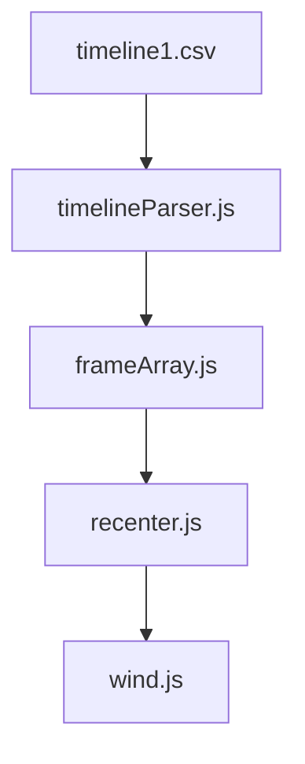

# 函数工作逻辑图



1. 根据逻辑图 输出36x36风扇pwm
2. wind.js 内函数作用区域仅为给出 width height 区域
3. value 等比转为 0-1 区间 只允许2位小数
4. 根据centerX centerY 确定 width height 区域
5. 区域外 pwm 一律输出为 22

```json
[
  {
    timeline: '0',
    centerX: '15',
    centerY: '23',
    width: '12',
    height: '34',
    value1: '45678',
    easing1: 'none',
    value2: '12345',
    easing2: 'none'
  },
  {
    timeline: '0.2',
    centerX: '7',
    centerY: '19',
    width: '28',
    height: '11',
    value1: '12345',
    easing1: 'easeInOutBack',
    value2: '23456',
    easing2: 'easeInOutBack'
  },
  {
    timeline: '0.4',
    centerX: '36',
    centerY: '5',
    width: '30',
    height: '22',
    value1: '98765',
    easing1: 'easeInOutCubic',
    value2: '34567',
    easing2: 'easeInOutCubic'
  },
  {
    timeline: '0.8',
    centerX: '18',
    centerY: '31',
    width: '17',
    height: '29',
    value1: '21098',
    easing1: 'easeOutExpo',
    value2: '45678',
    easing2: 'easeOutExpo'
  },
  {
    timeline: '1.2',
    centerX: '25',
    centerY: '14',
    width: '6',
    height: '36',
    value1: '76543',
    easing1: 'easeInBack',
    value2: '56789',
    easing2: 'easeInBack'
  },
  {
    timeline: '1.3',
    centerX: '10',
    centerY: '27',
    width: '21',
    height: '8',
    value1: '54321',
    easing1: 'easeOutQuad',
    value2: '67890',
    easing2: 'easeOutQuad'
  }
]
```

```json

[
    {

    duration: json[i+1].timeline - json[i].timeline,
    value1: [json[i].value1,json[i+1].value1],
    value2: [json[i].value2,json[i+1].value2],
    easing1: json[i+1].easing1,
    easing2: json[i+1].easing2

    }
]

```

```json

{
    centerX: [],
    centerY: [],
    width: [],
    height: []
}
```

```json

{
    value1: [],
    value2: [],
}
```

```json
[
  {
    duration: 0.2,
    value1: [ '45678', '12345' ],
    value2: [ '12345', '23456' ],
    easing1: 'easeInOutBack',
    easing2: 'easeInOutBack'
  },
  {
    duration: 0.2,
    value1: [ '12345', '98765' ],
    value2: [ '23456', '34567' ],
    easing1: 'easeInOutCubic',
    easing2: 'easeInOutCubic'
  },
  {
    duration: 0.4,
    value1: [ '98765', '21098' ],
    value2: [ '34567', '45678' ],
    easing1: 'easeOutExpo',
    easing2: 'easeOutExpo'
  },
  {
    duration: 0.4,
    value1: [ '21098', '76543' ],
    value2: [ '45678', '56789' ],
    easing1: 'easeInBack',
    easing2: 'easeInBack'
  },
  {
    duration: 0.1,
    value1: [ '76543', '54321' ],
    value2: [ '56789', '67890' ],
    easing1: 'easeOutQuad',
    easing2: 'easeOutQuad'
  }
]

```
